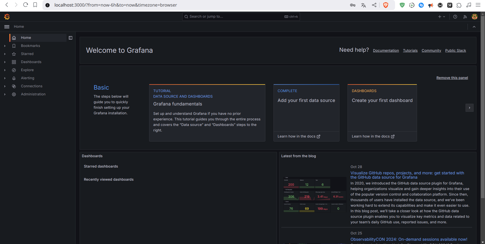

# Intro
An application for predicting pneumonia in a chest X-ray image. It is ready to be deployed to AWS through GitHub Actions:
- DVC for data versioning
- S3 for cloud storage
- MLflow for experiment tracking
- TensorflowServing for inference endpoint
- Prometheus/Grafana for system monitoring
- GitHub Actions for CI/CD
- AWS for deployment infrastructure
# ENV

```bash
conda create -n obj python=3.9 -y

conda activate obj

pip install -r requirements.txt

git init

dvc init

python3 setup.py install
```
# AWS
- Create bucket
- Create iamuser
- Config aws cli

```bash
aws configure
```
If deploy
- Create container registry
- create virtual server
- Config github action environment variable
# RUN
```bash
dvc repro

dvc add artifact/data_ingestion/data
```
# Create Compse
```bash
docker compose up
```

# Deploy

